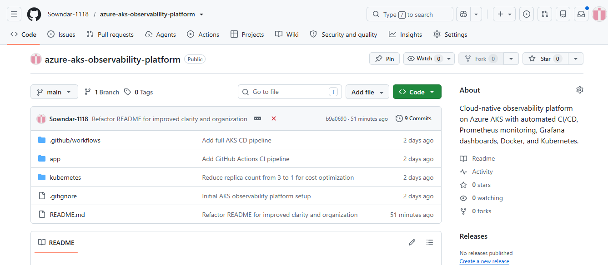
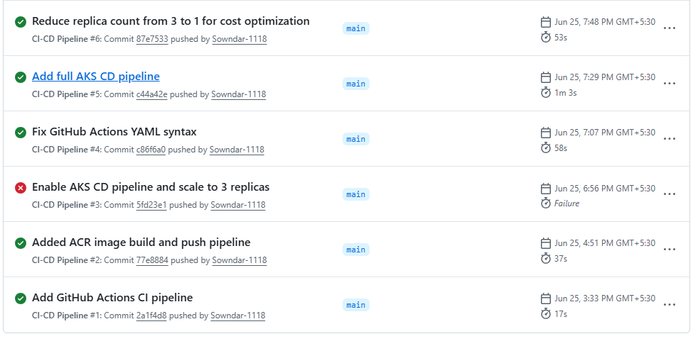
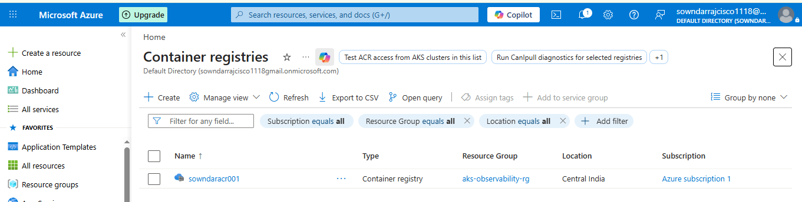
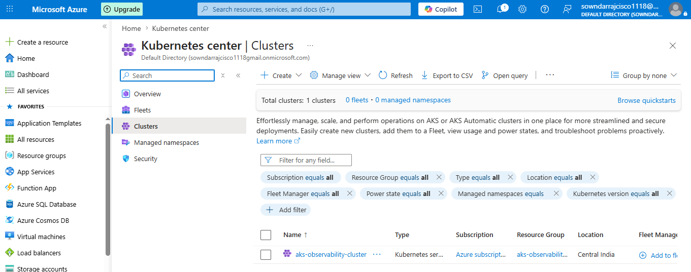
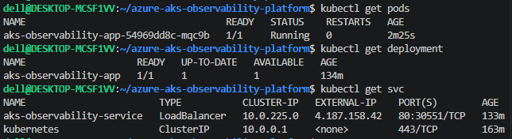
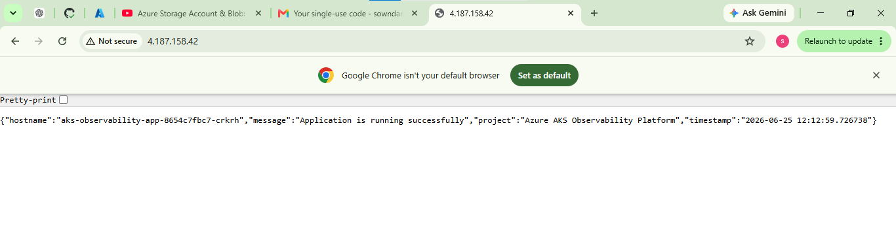
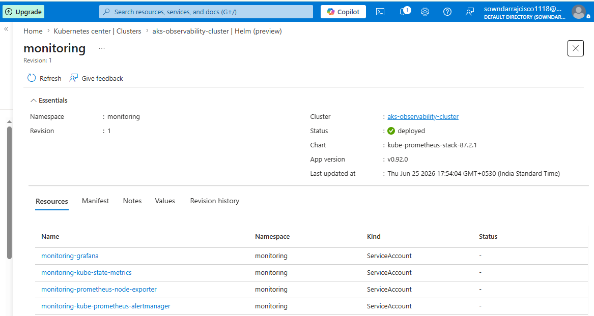
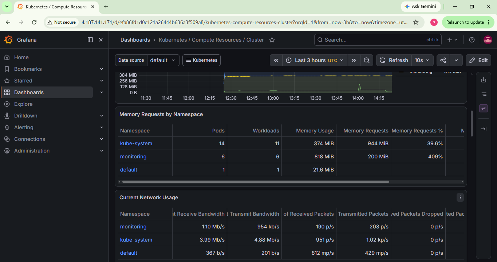

# Azure AKS Observability Platform

## Overview

Azure AKS Observability Platform is an end-to-end cloud-native DevOps project that demonstrates automated application deployment, containerization, Kubernetes orchestration, and monitoring on Microsoft Azure.

The project uses GitHub Actions for Continuous Integration (CI), Docker for containerization, Azure Container Registry (ACR) for image storage, Azure Kubernetes Service (AKS) for application deployment, and Prometheus with Grafana for monitoring and observability.

This project simulates a production-style deployment workflow using modern DevOps practices.

---

## Solution Architecture

```text
Developer
    │
    ▼
GitHub Repository
    │
    ▼
GitHub Actions (CI)
    │
    ▼
Docker Image Build
    │
    ▼
Azure Container Registry (ACR)
    │
    ▼
Azure Kubernetes Service (AKS)
    │
    ▼
Kubernetes Deployment
    │
    ▼
Application Pods
    │
    ▼
LoadBalancer Service
    │
    ▼
Python Flask Application

----------------------------------------

Prometheus
    │
    ▼
Collect Kubernetes Metrics
    │
    ▼
Grafana
    │
    ▼
Real-Time Dashboards
```

---

## Features

* Automated CI pipeline using GitHub Actions
* Docker image build and push to Azure Container Registry
* Kubernetes application deployment on Azure Kubernetes Service
* Rolling deployment strategy
* Containerized Python Flask application
* Kubernetes LoadBalancer service
* Prometheus metrics endpoint
* Prometheus monitoring using Helm
* Grafana dashboards for visualization
* Kubernetes cluster observability

---

## Technology Stack

| Category             | Technology                     |
| -------------------- | ------------------------------ |
| Cloud                | Microsoft Azure                |
| Container Registry   | Azure Container Registry (ACR) |
| Kubernetes           | Azure Kubernetes Service (AKS) |
| Containerization     | Docker                         |
| CI                   | GitHub Actions                 |
| Monitoring           | Prometheus                     |
| Visualization        | Grafana                        |
| Package Manager      | Helm                           |
| Programming Language | Python                         |
| Framework            | Flask                          |
| Operating System     | Ubuntu (WSL2)                  |

---

## Project Structure

```text
azure-aks-observability-platform/

├── .github/
│   └── workflows/
│       └── ci.yml
│
├── app/
│   ├── app.py
│   ├── Dockerfile
│   └── requirements.txt
│
├── kubernetes/
│   ├── deployment.yaml
│   └── service.yaml
│
├── monitoring/
│   ├── grafana/
│   └── prometheus/
│
├── screenshots/
│   ├── ACR.png
│   ├── AKS-Cluster.png
│   ├── Github-Actions-Successful-Pipeline.png
│   ├── Github-Repository.png
│   ├── Grafana-Dashboard.png
│   ├── Kubectl-Pods.png
│   ├── Prometheus-Targets.png
│   └── Python-Flask-Application.png
│
├── .gitignore
├── README.md
└── venv/
```

---

## CI/CD Workflow

```text
Developer
      │
      ▼
Push Code to GitHub
      │
      ▼
GitHub Actions
      │
      ▼
Build Docker Image
      │
      ▼
Push Image to Azure Container Registry
      │
      ▼
Deploy to Azure Kubernetes Service
      │
      ▼
Rolling Update
      │
      ▼
Application Available
```

---

## Application Endpoints

| Endpoint   | Description        |
| ---------- | ------------------ |
| `/`        | Application Home   |
| `/health`  | Health Check       |
| `/info`    | System Information |
| `/metrics` | Prometheus Metrics |

---

## Monitoring Stack

### Prometheus

Prometheus collects metrics from:

* Kubernetes Nodes
* Pods
* Deployments
* Services
* kube-state-metrics
* Node Exporter
* Application metrics (`/metrics`)

### Grafana

Grafana dashboards provide visibility into:

* Kubernetes Cluster Overview
* Node Metrics
* CPU Utilization
* Memory Utilization
* Pod Health
* Network Usage
* Workload Monitoring

---

## Project Screenshots

### GitHub Repository



### GitHub Actions Successful Pipeline



### Azure Container Registry



### Azure Kubernetes Service




### Kubernetes Pods



### Python Flask Application



### Prometheus Targets



### Grafana Dashboard




---

## Verification

```bash
kubectl get nodes

kubectl get pods

kubectl get deployments

kubectl get svc
```

---

## Author

**Sowndarraj M**

AWS Certified Solutions Architect – Associate

GitHub
https://github.com/Sowndar-1118

LinkedIn
https://www.linkedin.com/in/sowndarraj-m-b35634200
